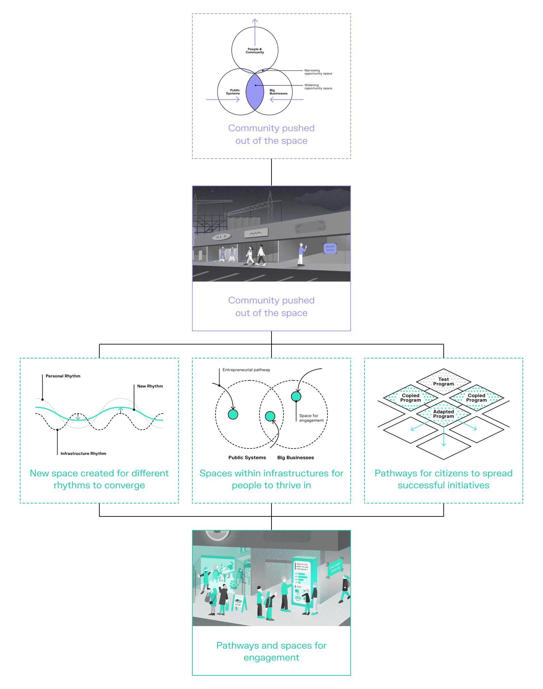

The rising awareness of the climate crisis in addition to the arrival of the pandemic has powerfully altered our ways of seeing and understanding the interactions we have with each other and with our environments. It is a time of blurred lines—between work and leisure, urban and rural, global and local. These trends are nothing new. The crises have, if anything, accelerated developments that have been ongoing for some time.

With Hitachi Design London, we examined the blurring or melting together of things once seen as separate. The objective was to create tangible illustrations exploring transitions inspired by the melting together of dualities. The design team was responsible for thinking through the long-term directions and implications of infrastructure for society and initiating collaborations with other business departments to implement these visions in reality.

#### Publishing platform

We collaborated with Core77 to live-publish the ongoing process and reflection of the project. The three-part series is available on the following links:

- [Starting a Discursive Design Project Amidst Anthropocene and Pandemic](https://www.core77.com/posts/101337/Starting-a-Discursive-Design-Project-Amidst-Anthropocene-and-Pandemic)
- [Trap of Utopia: Capturing People's Anxieties in a Discursive Design Project](https://www.core77.com/posts/103412/Trap-of-Utopia-Capturing-Peoples-Anxieties-in-a-Discursive-Design-Project)
- [The Importance of Locale in Envisioning the Future](https://www.core77.com/posts/108964/The-Importance-of-Locale-in-Envisioning-the-Future)

#### Process

One approach we took to selecting the project's sites was to work with locales which, in their history and current existence, vividly embody the blurring of lines. We imagined three locales that typify distinct characteristics in European cities; The Suburban Town, The Seasonal Tourism City and The Energy City. This allowed us to explore how the pandemic might further alter their particular cultures.

The goal of the project was to create a series of visualisations from multiple futures where the blurring of lines in each locale is addressed for the community's needs. To achieve the goal, we started by deeply understanding the locales through a number of local residents interviews, expert interviews and desk research.

Acknowledging the diverse range of anxieties felt during the pandemic meant that we needed to capture not only desirable futures, but also people's concerns and frictions in systems. After many rounds of discussion and interviewing, we created two types of frameworks; Forecasted Anxiety Frameworks that capture the residents' emotional responses towards the pandemic and the flaws in the city exposed by it, and Desirable Future Frameworks that allow us to imagine approaches to address the anxiety and mitigate the risk.

The scenes we illustrated are what instances of these anxieties or desirable futures could look like. These scenes make the potential transitions feel more tangible.

#### Outcome

We have created a set of illustrations and frameworks that capture both people's negative emotional responses towards the pandemic and potential approaches to addressing their anxieties. The final report is being used by Hitachi's R&D initiatives in Europe to further develop ideas and engage with stakeholders at each site.

#### Credit

- Client: Hitachi, Ltd.
- Direction: Yosuke Ushigome (Takram)
- Research: Jonathan Skjøtt (Takram), Fiona Lin (Takram)
- Illustration: Maki Ota
