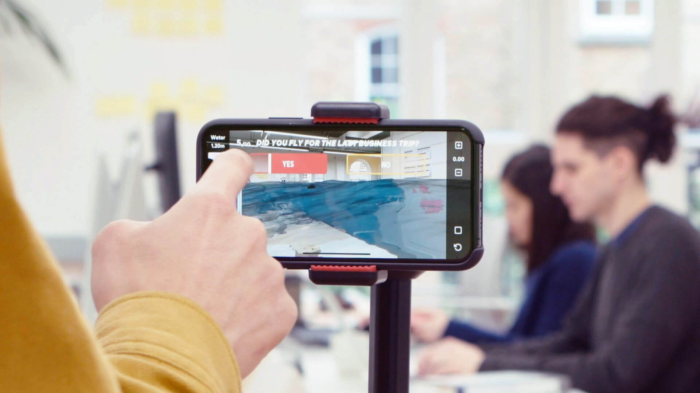

At Takram, we had the chance to present our approaches to Data Humanisation at the 2020 Design Indaba. One of them was RISAR – an augmented reality visualisation app prototype that personalises the effects of climate change to question our thoughts and actions concerning the climate crisis. Details of the presentation are available on [Takram Stories](https://medium.com/takram-stories/data-humanisation-in-action-2555172f96b4).

#### Data Humanisation in Action

RISAR asks you a set of questions about your day-to-day activities, and you answer them with a simple, almost Tinder-like interaction between different options (e.g. food choice, travel option etc.) The virtual water level rises or falls, depending on your answer. We believe RISAR has the potential to become a powerful experience that shows how individual lifestyle choices can cause a massive, collective impact on the world.

To demonstrate how immersive data experience (e.g. AR, VR, etc.) can facilitate a better understanding of issues like climate change, we tested out RISAR in front of a live audience. We gave everyone a ping-pong bat, coloured red on one side and yellow on the other, to use in response to the questions displayed on the presentation screen. Fortunately for the Indaba audience, their answers resulted in them escaping from a mass AR drowning!

#### Credit

- Concept & Design: Yosuke Ushigome (Takram)
- Demo & Presentation Assistance: Ken Fujiyoshi (Takram)
- Research: Jonathan Skjøtt (ex-Takram)
- Production: [BYO](https://byo.works/)
- Software Development: BAUD
