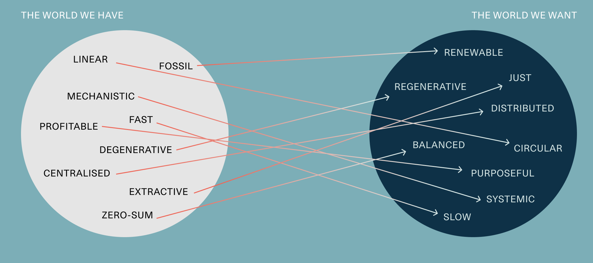

We jointly conducted a research with the R&D Group of Hitachi, Ltd. and published as a website that explains nine transitions we can make toward a more sustainable world.

[https://sustainability-transitions.com/](https://sustainability-transitions.com/)

A transition is a gradual, progressive shift from one state to another. In this context, we’re talking about moving from one social, political, or economic system into another. With the intention of informing and inspiring people, we used carefully constructed text, diagrams and information architecture to illustrate the key concepts of the anticipated systemic changes.

The goal of this project was to help nurture a deeper understanding of the interrelations among the plant, human and the problems we face, and to articulate the anticipated transitions toward a sustainable future.

We focused on the concept of transitions and researched various structural shifts such as fossil fuels to renewable energy, from linear to circular economy, and from loss of biodiversity to its regeneration. These transitions are richly described using the research and dialogue with leading international organisations and individuals.

Each transition is represented by a common design language inspired by arrows and a diagram that outlines pathways of systemic change from the world we have to the world we want.

#### Credit

- Clinet: [Hitachi, Ltd. R&D Group](https://www.hitachi.com/rd/)
- Project Vision and Research Concept: Koji Sasaki (Hitachi)
- Hitachi Engagement: Kazuhiro Ikegaya (Hitachi)
- Creative Direction: Yosuke Ushigome (Takram)
- Research: Yosuke Ushigome (Takram), Jonathan Skjøtt (Takram), Fiona Lin (Ex-Takram)
- Production Management: [BYO](https://byo.works/)
- Web Design: [Bibliothèque Design](https://bibliothequedesign.com/)
- Web Design (Japanese): [The Guild](https://theguild.jp/)
- Web Development: Jonathan Skjøtt (Takram)
- Copy Editing: [Reed Words](https://www.reedwords.com/)
- Copy Editing (Japanese): Arina Tsukada (Whole Universe)
- PR in Japan: [Yoshimi Irie](https://www.linkedin.com/in/%E5%A5%BD%E7%BE%8E-%E5%85%A5%E6%B1%9F-047439200/)
